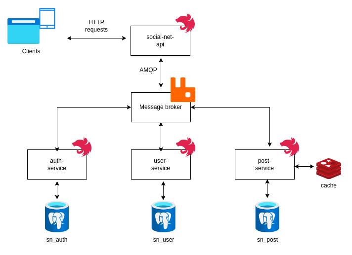

# Social Net service coursework

## Project structure
* lib-core : lib that contains dtos and common logic for all microservices
* auth-service: service that contains user auth logic
* user-service: responsible for storing and providing user data
* post-service: responsible for storing and providing posts info

## Infrastructure
* storage: postgres - db per service
* broker: rabbitmq to transfer messages between microservices
* redis: dragonfly - lightweight redis alternative that implements redis contract
* migrations: set of migrations to run (maybe better to move on service level)

to start infrastructure run `docker-compose up`

## Deploy
to launch services run:
`docker-compose -f services-docker-compose.yaml up --build`
service will be available on port 3000

## Documentation
swagger is located at: http://localhost:3000/api#/

## Comments on requirements
1. Створення додатку (10 балів):
*  Розробити серверний додаток на базі Express або NestJS (4 бали).
    * all services are nest microservices
* Використати PostgreSQL як основну базу даних (3 бали).
  * postgres is used see coursework/lib-core/src/repository/db.connection.ts
* Налаштувати Swagger для документування API (3 бали).
  * swagger is at http://localhost:3000/api#/

2. Сутності (10 балів):
* Створити таблицю users для зберігання основної інформації про користувачів (5 балів).
  * see coursework/migrations/sn-user
  * see coursework/migrations/sn-auth
* Створити таблицю posts для зберігання інформації про пости користувачів (5 балів).
  * see coursework/migrations/sn-posts

3. CRUD операції (15 балів):
* Для users:
    * POST /user для створення користувача з хешованим паролем (bcrypt) (5 балів).
      * see coursework/user-service/src/service/user.service.ts
* Для posts:
    * POST /posts для створення нового посту для авторизованого користувача (5 балів).
        * see coursework/post-service/src/service/post.service.ts
    * GET /posts/ для отримання всіх постів користувача з кешуванням в Redis (5 балів).
        * see coursework/post-service/src/service/post.service.ts

4. JWT авторизація (10 балів):
* Реалізувати JWT авторизацію з токеном, який має термін дії (10 балів).
  * see coursework/auth-service/src/service/auth.service.ts
* Токен приходить на запит get-token, з логіном і паролем юзера.
  * see coursework/socialnet-api/src/controller/auth.controller.ts

5. Кешування через Redis (5 балів):
* Реалізувати кешування результатів GET-запитів до /posts/
  * implemented see coursework/post-service/src/service/post.service.ts 
* через Redis (5 балів).
  * redis present

6. Валідація та помилки (5 балів):
* Реалізувати 401 Unauthorized для запитів без валідного токена (3 бали).
  * see coursework/socialnet-api/src/guard/jwt-decode.guard.ts
* Реалізувати 403 Forbidden при відсутності необхідних параметрів (2 бали).
  * global validation pipeline added coursework/socialnet-api/src/main.ts

7. Docker та Docker Compose (10 балів):
* Налаштувати Docker для контейнеризації додатку (5 балів).
    * each service have dockerfile example: coursework/post-service/Dockerfile
* Налаштувати Docker Compose для одночасного запуску серверу, PostgreSQL та Redis (5 балів).
    * docker-compose.yaml file present

8. Тестування (5 балів):
* Написати юніт-тести для CRUD операцій, авторизації та кешування (3 бали).
  * not full coverage but sample present  see coursework/post-service/src/service/post.service.spec.ts 
* Додати інтеграційні тести для перевірки роботи додатку (2 бали).
  * basic sample don't have enough time coursework/socialnet-api/test/app.e2e-spec.ts
